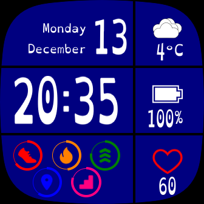

# Description
A really simple and fun clock that use a font designed to make life easier for dyslexic people.
This clock is build for fitbit smartwatchs (Versa 3 & Sense).

# Features
It include :
- Clock.
- Date.
- Steps counter (colors and icon changed when you reach your goal).
- Battery indicator.
- Heart Rate Monitor.
- Settings to change colors.
- Weather.

Let me know if you need more ;)

# Demo
This clock can be installed on your device (Sense, Versa 3) via this link: [Fitbit store](https://gallery.fitbit.com/details/a9e11f57-176d-4b1a-b451-f93191ccb56d)

# Why?
I have shared this code to allow developer to make more clocks accessible for dyslexic users.

Please do use this clock as this, change it to have your hown design

# How to edit and buid?
This code was build for and with Visual Studio Code.

It use :
- NPM
- Fitbit SDK
- TypeScript
- SVG
- CSS

# Need something?
Ask me if you need any help or new features.
